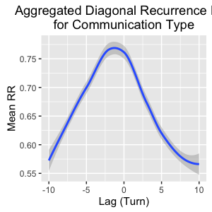
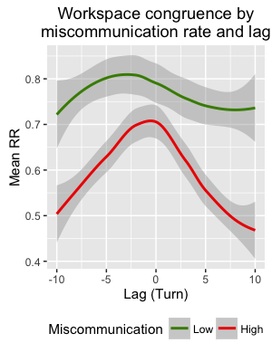

# Dynamics of Coordination in Miscommunication: Data analysis for Paxton, Roche, & Tanenhaus (in preparation)

This R markdown contains the analyses for "Two to tangle: Conceptualizing miscommunication as a dyadic process" (Paxton, Roche, & Tanenhaus, in preparation), which explores linguistic and semantic coordination during miscommunication in a collaborative dyadic task.

To run completely from scratch, you will require the following files:

-   `./data/BlocoCharLength12-16-15.csv`
-   `./supplementary-code/libraries-and-functions-CM.r`
-   `./supplementary-code/recurrence-settings-CM.r`
-   `./supplementary-code/continuous-rqa-parameters-CM.r`

Additional files required for the data analysis will be generated at various steps throughout the code, primarily during Sections 1-3. For this reason, Sections 1-3 need only be run once to create and save the files needed for analysis in Section 4. After that, Section 4 can be run repeatedly without needing to prepare the data each time. The chunks of code in Sections 1-3 are accordingly set by default to `eval=FALSE`.

**Written by**: A. Paxton (University of California, Berkeley) <br>**Date last modified**: 3 October 2016

------------------------------------------------------------------------

Global preliminaries
====================

This section takes care of data import and preparation. As a new analysis of the Bloco corpus (Roche, Paxton, Ibarra, & Tanenhaus, 2013, under review; Paxton, Roche, & Tanenhaus, 2015; Paxton, Roche, Ibarra, & Tanenhaus, 2014), the original data file includes coded variables from prior work.

**NOTE**: The chunks of code in this section do not have to be run each time (except for the first chunk), since the resulting datasets will be saved to CSV files. As a result, these chunks are currently set to `eval=FALSE`. Bear this in mind if these data need to be re-calculated.

------------------------------------------------------------------------

Load data and libraries
-----------------------

This section loads in the necessary modules and initial data files.

``` r
# preliminaries
rm(list=ls())

# load functions and parameters for recurrence analyses
source('./supplementary-code/libraries-and-functions-CM.r')
source('./supplementary-code/recurrence-settings-CM.r')
```

------------------------------------------------------------------------

Add global variables
--------------------

This section adds a counter for all turns within each dyad (`tTurn`) and a numeric variable for communication type (`commtype`).

``` r
# import initial data file
bloco = read.csv('./data/BlocoCharLength12-16-15.csv',
         header=TRUE,row.names=NULL)

# create a new turn variable that cuts across all trials
bloco$tTurn = 0
for (dyad in unique(bloco$Pair)){
 bloco[bloco$Pair==dyad,]$tTurn =
  seq(1,length(bloco[bloco$Pair==dyad,]$Turn))
}

# create numeric (factor) communication type variable
bloco$commtype = as.numeric(bloco$CommunicationType)
bloco$commtype = as.factor(bloco$commtype)

# export new file
write.csv(bloco, './data/bloco-raw_data-coordination_miscommunication_analyses.csv', 
     row.names=FALSE)
```

------------------------------------------------------------------------

Recurrence analyses
===================

This section runs all recurrence-related analyses.

**NOTE**: The chunks of code in this section do not have to be run each time, since the resulting datasets will be saved to CSV files. As a result, these chunks are currently set to `eval=FALSE`. Bear this in mind if these data need to be re-calculated.

------------------------------------------------------------------------

Calculating workspace congruence
--------------------------------

This section calculates recurrence over partners' workspaces, quantifying the dynamics as two individual time series (i.e., CRQA).

------------------------------------------------------------------------

### Calculate DRPs over workspaces

We now calculate the diagonal recurrence profile (DRP) for each pair. This quantifies the amount of recurrence between participants within a window of lags around lag-0 (i.e., synchrony). We then plot the mean DRP across all dyads.

``` r
# subset data to the bare minimum for DRPs over workspace congruence
bloco_vis = select(bloco,Pair,Trial,Turn,tTurn,Talker,lCong,CommunicationType,commtype)

# run recurrence analyses for each dyad
cross_rec_drp = data.frame()
for (dyad in unique(bloco_vis$Pair)){

 # cross-recurrence over the shared workspace
 p1 = bloco_vis[bloco_vis$Pair==dyad & 
          bloco_vis$Talker == "E",]$commtype
 p2 = bloco_vis[bloco_vis$Pair==dyad & 
          bloco_vis$Talker == "NE",]$commtype

 # ensure that they're of equal lengths; if not, trim longer
 p.ts = equal.lengths(p1,p2)
 p1 = unlist(p.ts[[1]])
 p2 = unlist(p.ts[[2]])

 # generate DRPs for cross-recurrence over partners' workspaces
 crossrec = drpdfromts(p1,p2,win_size,datatype="categorical",1)
 next_drp = data.frame(dyad,crossrec$profile,-win_size:win_size)
 names(next_drp) = c("dyad","rec","lag")
 cross_rec_drp = rbind.data.frame(cross_rec_drp,next_drp)

}

# write the DRP info to file
write.csv(cross_rec_drp,'./data/drp-workspace-cross.csv',
     row.names=FALSE)
```



------------------------------------------------------------------------

Quantifying linguistic coordination
-----------------------------------

This section calculates recurrence over partners' linguistic coordination. Linguistic and pragmatic contributions are measured turn level. CRQA is run over participants' time series.

Congruent with our previous manuscript (Roche et al., under review), we will focus on the following linguistic and pragmatic metrics, assessed at the turn level:

-   **Informativeness** (`charlength`), or the number of characters per turn
-   **Grounding** (`UsedAssent`), or whether a member of LIWC's (Pennebaker, Francis, & Booth, 2007) "Assent" category is used (binary)
-   **Spatial terms** (`spatialutterance`), or whether a member of LIWC's (Pennebaker, Francis, & Booth, 2007) "Spatial" category is used (binary)
-   **Requests for repair** (`RepairPresent`), or whether a question mark is used (binary)

------------------------------------------------------------------------

### Run CRQA over categorical linguistic data

Here, we run CRQA over partners' linguistic and pragmatic data. Three of the variables (`UsedAssent`, `spatialutterance`, and `repairPresent`) are binary and are subject to categorical CRQA.

``` r
# read in bloco dataset
bloco = read.csv('./data/bloco-raw_data-coordination_miscommunication_analyses.csv',
         header=TRUE,row.names=NULL)

# subset data to minimum for recurrence over language
bloco_lang = select(bloco,Pair,Trial,Turn,tTurn,Talker,
          charlength,spatialutterance,
          UsedAssent,RepairPresent)

# standardize informativeness (character length)
bloco_lang$charlength.std = scale(bloco_lang$charlength)

# run recurrence analyses for each dyad
cross_rec_spatial = data.frame()
cross_rec_ground = data.frame()
cross_rec_repair = data.frame()
split_df = split(bloco_lang, bloco_lang$Pair)
for (dyad_df in split_df){
  
  # divide by participant
  p1 = dyad_df[dyad_df$Talker == "E",]
  p2 = dyad_df[dyad_df$Talker == "NE",]
    
  # perform cross-recurrence over spatial terms
  crossrec = crqa(p1$spatialutterance, p2$spatialutterance, 
                  delay, embed, rescale, radius, normalize,
                  mindiagline, minvertline, tw, whiteline, recpt, side, checkl)
  next_data_line = data.frame(c(dyad,crossrec[1:9]))
  names(next_data_line) = c("dyad",names(crossrec[1:9]))
  cross_rec_spatial = rbind.data.frame(cross_rec_spatial,next_data_line)
  
  # perform cross-recurrence over grounding
  crossrec = crqa(p1$UsedAssent, p2$UsedAssent, 
                  delay, embed, rescale, radius, normalize,
                  mindiagline, minvertline, tw, whiteline, recpt, side, checkl)
  next_data_line = data.frame(c(dyad,crossrec[1:9]))
  names(next_data_line) = c("dyad",names(crossrec[1:9]))
  cross_rec_ground = rbind.data.frame(cross_rec_ground,next_data_line)
  
  # perform cross-recurrence over repairs
  crossrec = crqa(p1$RepairPresent, p2$RepairPresent, 
                  delay, embed, rescale, radius, normalize,
                  mindiagline, minvertline, tw, whiteline, recpt, side, checkl)
  next_data_line = data.frame(c(dyad,crossrec[1:9]))
  names(next_data_line) = c("dyad",names(crossrec[1:9]))
  cross_rec_repair = rbind.data.frame(cross_rec_repair,next_data_line)
}

# save CRQA results stats to files
write.csv(cross_rec_spatial,'./data/CRQA-spatial.csv',row.names=FALSE)
write.csv(cross_rec_ground,'./data/CRQA-ground.csv',row.names=FALSE)
write.csv(cross_rec_repair,'./data/CRQA-repair.csv',row.names=FALSE)
```

------------------------------------------------------------------------

### Run CRQA over continuous linguistic data

Our final predictor (`charlength`) is continuous, so it is standardized and then subjected to continuous CRQA instead. A supplementary source file (`./supplementary-code/continuous-rqa-parameters-CM.r`) calculates the necessary parameters for this step.

``` r
source('./supplementary-code/continuous-rqa-parameters-CM.r')
```

``` r
# read in our chosen parameters
crqa_parameters = read.table('./data/crqa_data_and_parameters-CM.csv', sep=',',header=TRUE)

# run recurrence analyses for each dyad
cross_rec_info = data.frame()
split_df = split(crqa_parameters, crqa_parameters$Pair)
for (dyad in split_df){
  
  # identify our parameters here
  chosen_radius = unique(dyad$chosen_radius)
  chosen_delay = unique(dyad$chosen_delay)
  chosen_embed = unique(dyad$chosen_embed)
  pair = unique(dyad$Pair)
  
  # perform cross-recurrence over informativeness
  p1 = dyad[dyad$Talker == "E",]$rescale_charlength
  p2 = dyad[dyad$Talker == "NE",]$rescale_charlength
  crossrec = crqa(p1, p2, delay=chosen_delay, embed=chosen_embed, 
                  radius=chosen_radius, rescale=0,
                  normalize, mindiagline, minvertline, tw, 
                  whiteline, recpt, side, checkl)
  next_data_line = data.frame(c(pair,crossrec[1:9]))
  names(next_data_line) = c("dyad",names(crossrec[1:9]))
  cross_rec_info = rbind.data.frame(cross_rec_info,next_data_line)
  
}

# save CRQA results stats to files
write.csv(cross_rec_info,'./data/CRQA-info.csv',row.names=FALSE)
```

------------------------------------------------------------------------

### Calculate DRPs over categorical linguistic data

After having obtained the full CRQA data from the previous section, we now calculate the diagonal recurrence profile (DRP) for each pair. This quantifies the amount of recurrence between participants within a window of lags around lag-0 (i.e., synchrony). We then plot the mean DRP for each linguistic metric across all dyads. This section focuses only on the categorical linguistic data: `repair`, `ground`, and `spatial`.

``` r
# subset data to minimum for recurrence over language
bloco_lang = select(bloco,Pair,Trial,Turn,tTurn,Talker,
        charlength,spatialutterance,
        UsedAssent,RepairPresent)

# split by dyad
split_df = split(bloco_lang, bloco_lang$Pair)

# run recurrence analyses for each dyad
drp_repair = data.frame()
drp_ground = data.frame()
drp_spatial = data.frame()
for (dyad in split_df){
  
  # find pair number
  pair = unique(dyad$Pair)
  
  # equalize lengths
  p1 = dyad[dyad$Talker == "E",]
  p2 = dyad[dyad$Talker == "NE",]
  trimmed.ts = equal.lengths(p1,p2)
  p1 = trimmed.ts[[1]]
  p2 = trimmed.ts[[2]]
  
  # generate DRPs for cross-recurrence over grounding words
  crossrec = drpdfromts(p1$UsedAssent,p2$UsedAssent,
                        ws=win_size,datatype="categorical",radius=.00001)
  next_drp = data.frame(pair,crossrec$profile,-win_size:win_size)
  names(next_drp) = c("dyad","rec","lag")
  drp_ground = rbind.data.frame(drp_ground,next_drp)

  # generate DRPs for cross-recurrence over spatial data
  crossrec = drpdfromts(p1$spatialutterance,p2$spatialutterance,
                        ws=win_size,datatype="categorical",radius=.00001)
  next_drp = data.frame(pair,crossrec$profile,-win_size:win_size)
  names(next_drp) = c("dyad","rec","lag")
  drp_spatial = rbind.data.frame(drp_spatial,next_drp)

  # generate DRPs for cross-recurrence over repair data
  crossrec = drpdfromts(p1$RepairPresent,p2$RepairPresent,
                        ws=win_size,datatype="categorical",radius=.00001)
  next_drp = data.frame(pair,crossrec$profile,-win_size:win_size)
  names(next_drp) = c("dyad","rec","lag")
  drp_repair = rbind.data.frame(drp_repair,next_drp)
}

# write the DRP info to file
write.csv(drp_repair,'./data/drp-repair.csv',row.names=FALSE)
write.csv(drp_ground,'./data/drp-ground.csv',row.names=FALSE)
write.csv(drp_spatial,'./data/drp-spatial.csv',row.names=FALSE)
```

------------------------------------------------------------------------

### Calculate DRPs over continuous linguistic data

We here focus on the continuous linguistic variable, `info`.

``` r
# read in our chosen parameters
crqa_parameters = read.table('./data/crqa_data_and_parameters-CM.csv', sep=',',header=TRUE)

# run recurrence analyses for each dyad
drp_info = data.frame()
split_df = split(crqa_parameters, crqa_parameters$Pair)
for (dyad in split_df){
  
  # identify our parameters here
  chosen_radius = unique(dyad$chosen_radius)
  pair = unique(dyad$Pair)
  
  # equalize lengths
  p1 = dyad[dyad$Talker == "E",]
  p2 = dyad[dyad$Talker == "NE",]
  trimmed.ts = equal.lengths(p1,p2)
  p1 = trimmed.ts[[1]]
  p2 = trimmed.ts[[2]]
  
  # generate DRPs for cross-recurrence over informativeness data
  crossrec = drpdfromts(p1$rescale_charlength,p2$rescale_charlength,
                        ws=win_size,datatype="continuous",radius=chosen_radius)
  next_drp = data.frame(pair,crossrec$profile,-win_size:win_size)
  names(next_drp) = c("dyad","rec","lag")
  drp_info = rbind.data.frame(drp_info,next_drp)
}

# write the DRP info to file
write.csv(drp_info,'./data/drp-info.csv',row.names=FALSE)
```

------------------------------------------------------------------------

### Merge DRP metrics with other data

Next, we need to prep the DRP data for statistical analysis. This section uses `dplyr` to quickly merge dataframes into a single output for us.

``` r
# load in the DRP files we need
drp_ground = read.csv('./data/drp-ground.csv',row.names=NULL,header=TRUE)
drp_info = read.csv('./data/drp-info.csv',row.names=NULL,header=TRUE)
drp_repair = read.csv('./data/drp-repair.csv',row.names=NULL,header=TRUE)
drp_spatial = read.csv('./data/drp-spatial.csv',row.names=NULL,header=TRUE)
drp_workspace = read.csv('./data/drp-workspace-cross.csv',
             row.names=NULL,header=TRUE) 

# rename the DRP variables to include descriptive prefix
drp_ground = add.var.prefix(drp_ground,"ground")
drp_info = add.var.prefix(drp_info,"info")
drp_repair = add.var.prefix(drp_repair,"repair")
drp_spatial = add.var.prefix(drp_spatial,"spatial")
drp_workspace = add.var.prefix(drp_workspace,"workspace")

# reload original corpus file
bloco = read.csv('./data/bloco-raw_data-coordination_miscommunication_analyses.csv',
         header=TRUE,row.names=NULL)

# join all DRP files together
all.drp.df = join(drp_info, drp_repair, by=c("dyad","lag"))
all.drp.df = join(all.drp.df,drp_spatial, by=c("dyad","lag"))
all.drp.df = join(all.drp.df,drp_ground, by=c("dyad","lag"))
all.drp.df = join(all.drp.df,drp_workspace, by=c("dyad","lag"))

# aggregate metrics of each conversation to join with the DRP metrics
just.animal = bloco %>% group_by(Pair) %>% 
 select(Animal) %>% summarize_each(funs(unique))
total.turns.and.miscomm = bloco %>% group_by(Pair) %>% 
 select(tTurn,runningcount) %>% summarize_each(funs(max))

# merge our aggregated bloco stats and then all DRPs
aggregate.bloco = left_join(just.animal,total.turns.and.miscomm, by="Pair")
aggregate.bloco.full = left_join(aggregate.bloco,all.drp.df, by=c("Pair" = "dyad"))
```

------------------------------------------------------------------------

Rename variables and save
-------------------------

Now that we've aggregated the recurrence data, let's take care of some last variable renaming and treatment before saving.

``` r
# rename some variables in aggregated dataframe
aggregate.bloco.full = plyr::rename(aggregate.bloco.full, 
                  c("runningcount" = "total.miscomm"))
aggregate.bloco.full = plyr::rename(aggregate.bloco.full, 
                  c("Pair" = "dyad"))

# save cleaned dataframes
write.csv(aggregate.bloco.full,'./data/bloco-drp_all+aggregated_data.csv',
     row.names=FALSE)
```

------------------------------------------------------------------------

Data preparation
================

After obtaining the recurrence metrics, we now prepare all data for analysis.

**NOTE**: The chunks of code in this section do not have to be run each time, since the resulting datasets will be saved to CSV files. As a result, these chunks are currently set to `eval=FALSE`. Bear this in mind if these data need to be re-calculated.

------------------------------------------------------------------------

Preliminaries
-------------

This section clears the workspace and reads in the prepared data files.

``` r
# clean up the workspace
rm(list=ls())

# import data
agg.bloco = read.csv('./data/bloco-drp_all+aggregated_data.csv',
           header=TRUE,row.names=NULL)

# re-read the supplementary info from other files
source('./supplementary-code/libraries-and-functions-CM.r')
source('./supplementary-code/recurrence-settings-CM.r')
```

------------------------------------------------------------------------

A note about dealing with lags
------------------------------

In planning the current analysis, we did not believe that the participants' roles in the experiment (i.e., whether the participant was eye-tracked or non-eye-tracked) would lead to a substantial change in leader/follower dynamics. As a result, we did not plan the study with an interest in exploring *specific* lag/lead dynamics; we were simply interested in the overarching *patterns* of coordination. As a result, we planned to transform lag into a variable measuring the time (in turns) from coordination, similar to previous analyses (cf. Paxton & Dale, 2013, *Quarterly Journal of Experimental Psychology*).

With this thinking, we had planned to analyze the absolute time-from-lag-0 value, rather than preserving the leader-follower structure within the data. After plotting the data (see DRP figure), however, it became evident that there were leader/follower patterns within the data. As a result, we decided to preserve the leader/follower dynamics within our analyses in order to more faithfully model the dynamics of the data (cf. Main, Paxton, & Dale, 2016, *Emotion*).

Although we cannot be sure of the reasons behind these patterns, these may be linked to the role of the participant -- that is, whether the participant was wearing the eyetracker (E) or not (NE). An E-leading pattern would be reflected in the DRP as a spike on the left-hand side relative to the right-hand side; an NE-leading pattern would be the reverse pattern.

In this task, the first participant to speak in the interaction was always the NE participant. During experiment design, this was simply a way of arbitrarily beginning the interaction. However, the characteristic patterns of E-NE dynamics in all of the DRPs may suggest that there is a "history" of this pattern that stays with the dyad throughout the entire interaction (cf. dynamical systems perspective).

------------------------------------------------------------------------

Prepare for growth curve analyses
---------------------------------

Given our decision to preserve the leader/follower dynamics of the data, we needed to capture the nonlinear shape of the DRPs. Therefore, we implement growth curve analyses to capture the nonlinear shape of the behavior across lags (for more, see Mirman, 2014).

Here, we explore the first- and second-order polynomials over lag. All polynomials are derived orthogonally in order to allow independent interpretation (cf. Mirman, 2014).

We also create a new term (`miscomm.ratio`) that accounts for the rate of miscommunication by dividing number of miscommunication turns by the total turns taken by the dyad.

``` r
# create miscommunciation rate term
agg.bloco$miscomm.ratio = agg.bloco$total.miscomm/agg.bloco$tTurn

# aggregate data at each lag
agg.all.lag = agg.bloco %>% ungroup() %>%
 select(info.rec, repair.rec, spatial.rec, ground.rec, workspace.rec, 
        lag, dyad, tTurn, miscomm.ratio) %>%
 group_by(dyad, lag) %>% summarise_each(funs(mean))

# create first- to second-order orthogonal polynomials for lag
raw.lag = -10:10
timeVals = data.frame(raw.lag)
t = poly(raw.lag + 11, 2)
timeVals[, paste("ot", 1:2, sep="")] = t[timeVals$raw.lag + 11, 1:2]

# join it to the original data table
agg.all.lag = left_join(agg.all.lag,timeVals, by = c("lag" = "raw.lag"))
```

------------------------------------------------------------------------

Aggregate mean recurrence rate variables
----------------------------------------

For the later analyses, we here create mean RR variables within the +/- 10-turn windows.

``` r
# mean RR for informativeness
mean.rec.values = agg.all.lag %>% group_by(dyad) %>%
  select(info.rec,ground.rec,spatial.rec,repair.rec,workspace.rec)%>%
  summarize_each(funs(mean)) %>%
  setNames(paste0('mean.', names(.))) %>%
  mutate(dyad = mean.dyad) %>%
  select(-mean.dyad)

# join everything together
agg.all.lag = left_join(agg.all.lag,mean.rec.values,by="dyad")
```

------------------------------------------------------------------------

Create interaction terms of interest
------------------------------------

Let's create interaction terms for our models. We need to separately specify them because we are standardizing the variables in the next step.

``` r
# create interactions with first-order polynomial
agg.ot1.interaction.vars = agg.all.lag %>%
 ungroup() %>%
 select(lag,dyad,ot1,ot2,tTurn,miscomm.ratio,matches("rec")) %>%
 mutate_each(funs(. * ot1), -c(lag,dyad,ot1)) %>%
 setNames(paste0('ot1.', names(.)))
agg.ot1.interaction.vars = plyr::rename(agg.ot1.interaction.vars, 
                    c("ot1.dyad" = "dyad", 
                     "ot1.ot1" = "ot1", "ot1.lag" = "lag"))

# create interactions with second-order polynomial
agg.ot2.interaction.vars = agg.all.lag %>%
 ungroup() %>%
 select(lag,dyad,ot1,ot2,tTurn,miscomm.ratio,matches("rec")) %>%
 mutate_each(funs(. * ot2), -c(lag,dyad,ot2)) %>%
 setNames(paste0('ot2.', names(.)))
agg.ot2.interaction.vars = plyr::rename(agg.ot2.interaction.vars, 
                    c("ot2.dyad" = "dyad",
                     "ot2.ot2" = "ot2", 
                     "ot2.lag" = "lag"))

# grab just the unique aggregated info for each dyad
agg.info = agg.bloco %>% ungroup() %>%
 select(dyad, Animal, tTurn, total.miscomm, miscomm.ratio) %>%
 distinct() %>% ungroup()

# join everything again
agg.bloco = join(agg.info,agg.ot1.interaction.vars, by = c("dyad"))
agg.bloco = join(agg.bloco,agg.ot2.interaction.vars, by = c("dyad", "lag"))
agg.bloco = join(agg.bloco,agg.all.lag, by = c("dyad", "lag", "ot1", "ot2"))

# convert character variable to numeric
agg.bloco$Animal = as.numeric(agg.bloco$Animal)
```

Before we standardize the dataframe in the next section, let's save the raw dataframe to facilitate plotting later.

``` r
# save plotting-ready dataframes
write.csv(agg.bloco,'./data/bloco-plotting_file-aggregated.csv',
     row.names=FALSE)
```

------------------------------------------------------------------------

Standardize variables
---------------------

In order to interpret the estimates of our forthcoming mixed-effects models as effect sizes (cf. Keith, 2008), we need to center and scale them before entering them.

``` r
# scale variables from the aggregated dataframe
agg.st = agg.bloco %>% ungroup() %>%
 purrr::keep(is.numeric) %>%
 mutate_each( funs( as.numeric( scale(.) )))

# convert factors back to factors
agg.st$Animal = as.factor(agg.st$Animal)
agg.bloco$Animal = as.factor(agg.bloco$Animal)
```

------------------------------------------------------------------------

Save analysis-ready files
-------------------------

Now that we've finished all data preparation, let's save the dataframes.

``` r
# save analysis-ready dataframes
write.csv(agg.st,'./data/bloco-analysis_file-aggregated.csv', row.names=FALSE)
```

------------------------------------------------------------------------

Data analysis
=============

After preparing the data, this section executes the analyses from the current article. (Unlike the previous sections, this section is evaluated again at each run.)

Each model is run once using standardized variables (allowing us to interpret the resulting estimates as effect sizes) and once using raw variables. Models are created with the following structure:

``` r
# example standardized model
standardized.repair.model = lmer(workspace.rec ~ ot1 + repair.rec + ot1.repair.rec + 
                  (1 + fef | dyad) + 
                  (1 + fef | Animal), 
                  data = agg.st)

# example unstandardized (raw) model
unstandardized.repair.model = lmer(workspace.rec ~ ot1 + repair.rec + ot1.repair.rec + 
                  (1 + fef | dyad) + 
                  (1 + fef | Animal), 
                  data = agg.plot)
```

where `fef` is the maximal random slope structure for each random intercept that will permit model convergence in the raw dataset. We use random intercepts for both `dyad` and `Animal`, with explanations for any exceptions.

------------------------------------------------------------------------

Preliminaries
-------------

``` r
# clean up the workspace
rm(list=ls())

# read the supplementary info from other files
source('./supplementary-code/libraries-and-functions-CM.r')
source('./supplementary-code/recurrence-settings-CM.r')

# import analysis and plotting dataframes
agg.st = read.csv('./data/bloco-analysis_file-aggregated.csv', 
         header=TRUE, row.names=NULL)
agg.plot = read.csv('./data/bloco-plotting_file-aggregated.csv',
          header=TRUE, row.names=NULL)
```

------------------------------------------------------------------------

Workspace congruence and task outcomes
--------------------------------------

Before turning to the linguistic and syntactic analyses, we first explore how workspace congruence is related to larger-scale task outcomes.

In these models, we include the random intercept for `Animal` and `dyad`, along with maximal random slopes that permit model convergence.

------------------------------------------------------------------------

### Success

The idea that increased workspace recurrence should be associated with improved task performance is an important link for the remainder of our analyses. Because all dyads eventually completed their figures (with the exception of very minor errors by 2 dyads), one metric of success is how smoothly the dyad performed the task, as measured by fewer miscommunications.

Therefore, this analysis explores whether the dynamics of workspace congruence (`workspace.rec`) predict improved performance through fewer instances of miscommunciation. Rather than predicting raw counts of miscommunication, we create a ratio of miscommunication turns relative to successful turns (`miscomm.ratio`) in order to abstract away from time spend engaged in the task.

``` r
# does miscommunciation (as a ratio of total turns) influence workspace congruence?
accuracy.miscomm.lme.st = lmer(workspace.rec ~ ot1 + ot2 + ot1.ot2 + 
                                 miscomm.ratio + ot1.miscomm.ratio + ot2.miscomm.ratio + 
                                  (1 + miscomm.ratio + ot2 | dyad) +
                                  (1 + miscomm.ratio + ot2 | Animal), 
                               data = agg.st, REML = FALSE)
pander_lme(accuracy.miscomm.lme.st,stats.caption=TRUE)
```

|                       | Estimate | Std..Error | t.value |   p   |   sig  |
|:---------------------:|:--------:|:----------:|:-------:|:-----:|:------:|
|    **(Intercept)**    |  -0.1791 |   0.1628   |   -1.1  |  0.27 |        |
|        **ot1**        |  -0.1939 |   0.05416  |  -3.581 | 3e-04 | \*\*\* |
|        **ot2**        |  -0.2259 |   0.08594  |  -2.629 |  0.01 |   \*   |
|      **ot1.ot2**      |  0.1769  |   0.02967  |  5.964  |   0   | \*\*\* |
|   **miscomm.ratio**   |  -0.8899 |   0.1047   |  -8.502 |   0   | \*\*\* |
| **ot1.miscomm.ratio** | -0.08549 |   0.04982  |  -1.716 |  0.09 |    .   |
| **ot2.miscomm.ratio** |  -0.205  |   0.08591  |  -2.386 |  0.02 |   \*   |

``` r
# unstandardized (raw) model
accuracy.miscomm.lme.raw = lmer(workspace.rec ~ ot1 + ot2 + ot1.ot2 + 
                                 miscomm.ratio + ot1.miscomm.ratio + ot2.miscomm.ratio + 
                                  (1 + miscomm.ratio + ot2 | dyad) +
                                  (1 + miscomm.ratio + ot2 | Animal), 
                                data = agg.plot, REML = FALSE)
pander_lme(accuracy.miscomm.lme.raw,stats.caption=TRUE)
```

|                       | Estimate | Std..Error | t.value |   p   |   sig  |
|:---------------------:|:--------:|:----------:|:-------:|:-----:|:------:|
|    **(Intercept)**    |  0.9159  |   0.01361  |   67.3  |   0   | \*\*\* |
|        **ot1**        |  -0.1297 |   0.03621  |  -3.581 | 3e-04 | \*\*\* |
|        **ot2**        |  -0.1511 |   0.05747  |  -2.629 |  0.01 |   \*   |
|      **ot1.ot2**      |  0.4353  |   0.07298  |  5.964  |   0   | \*\*\* |
|   **miscomm.ratio**   |  -0.8468 |   0.0996   |  -8.502 |   0   | \*\*\* |
| **ot1.miscomm.ratio** |  -0.1551 |   0.09039  |  -1.716 |  0.09 |    .   |
| **ot2.miscomm.ratio** |  -0.3719 |   0.1559   |  -2.386 |  0.02 |   \*   |

As anticipated, we find that *increased* workspace congruence is associated with *lower* miscommunication rates. We believe that exploring the ties between linguistic patterns and the unfolding dynamics of miscommunication would be an interesting avenue of scientific study in and of themselves. However, the above results suggest that these patterns may also be important to larger-scale task performance.



------------------------------------------------------------------------

### Total turns taken

It may also be interesting to see whether the dynamics of workspace congruence relate to the amount of time that a dyad takes (measured in number of turns) to complete the task. Given the results of the miscommunication analysis (`accuracy.miscomm.lme.st`), however, we first explore whether the number of turns significantly predicts the ratio of miscommunication to successful communication.

It would not here be appropriate to include `dyad` as a random effect, given that the both `tTurn` and `miscomm.ratio` covary perfectly with dyad (i.e., each dyad has a unique value for each of these variables). We still include the maximally permitted random effects structure for `Animal`. (We print only the standardized tests; unstandardized models are also set up in this markdown but silenced from output.)

``` r
# create a subset of the standardized data with one data point per dyad and rescale
turns.and.miscomm.data.st = agg.st %>% 
 group_by(dyad, tTurn, total.miscomm, miscomm.ratio, Animal) %>% 
  summarize()
turns.and.miscomm.data.st = as.data.frame(scale(turns.and.miscomm.data.st))

# does the rate of miscommunication affect how many turns a dyad takes?
turns.miscomm.lme.st = lmer(tTurn ~ miscomm.ratio + (1 + miscomm.ratio | Animal),
            data = turns.and.miscomm.data.st, REML = FALSE)
pander_lme(turns.miscomm.lme.st,stats.caption=TRUE)
```

|                   |  Estimate  | Std..Error |  t.value  |   p  | sig |
|:-----------------:|:----------:|:----------:|:---------:|:----:|:---:|
|  **(Intercept)**  | -1.668e-18 |   0.2083   | -8.01e-18 |   1  |     |
| **miscomm.ratio** |   0.2945   |   0.2137   |   1.378   | 0.17 |     |

The above analysis suggests that the rate of miscommunication does not significantly contribute to the number of turns that a dyad takes to complete the task. That is, more successful dyads statistically take neither more nor fewer turns than less successful dyads.

Next, we explore whether the time taken to complete the task is related to dynamics of workspace congruence.

``` r
# does length of time engaged in the task affect workspace congruence?
accuracy.time.lme.st = lmer(workspace.rec ~ ot1 + ot2 + ot1.ot2 + 
               tTurn + ot1.tTurn + ot2.tTurn + 
              (1 + ot1 + ot2 + ot1.ot2 | dyad) +
              (1 + ot1 + ot2 + ot1.ot2 | Animal),
              data = agg.st, REML = FALSE)
pander_lme(accuracy.time.lme.st,stats.caption=TRUE)
```

|                 |  Estimate  | Std..Error |  t.value  |   p   |  sig |
|:---------------:|:----------:|:----------:|:---------:|:-----:|:----:|
| **(Intercept)** |  1.965e-15 |   0.1975   | 9.953e-15 |   1   |      |
|     **ot1**     |   -0.2713  |   0.1045   |   -2.597  |  0.01 |  \*  |
|     **ot2**     |   -0.3146  |   0.1085   |    -2.9   | 0.004 | \*\* |
|   **ot1.ot2**   |   0.1769   |   0.0591   |   2.994   | 0.003 | \*\* |
|    **tTurn**    |   0.03494  |   0.1632   |   0.2141  |  0.83 |      |
|  **ot1.tTurn**  | -0.0003592 |   0.06941  | -0.005175 |   1   |      |
|  **ot2.tTurn**  |   -0.1054  |   0.1044   |   -1.01   |  0.31 |      |

``` r
# raw (unstandardized) model
accuracy.time.lme.raw = lmer(workspace.rec ~ ot1 + ot2 + ot1.ot2 + 
               tTurn + ot1.tTurn + ot2.tTurn + 
              (1 + ot1 + ot2 + ot1.ot2 | dyad) +
              (1 + ot1 + ot2 + ot1.ot2 | Animal),
              data = agg.plot, REML = FALSE)
pander_lme(accuracy.time.lme.raw,stats.caption=TRUE)
```

|                 |  Estimate  | Std..Error |  t.value  |   p   |   sig  |
|:---------------:|:----------:|:----------:|:---------:|:-----:|:------:|
| **(Intercept)** |   0.6456   |   0.06555  |    9.85   |   0   | \*\*\* |
|     **ot1**     |   -0.1814  |   0.06986  |   -2.597  |  0.01 |   \*   |
|     **ot2**     |   -0.2104  |   0.07255  |    -2.9   | 0.004 |  \*\*  |
|   **ot1.ot2**   |   0.4353   |   0.1454   |   2.994   | 0.003 |  \*\*  |
|    **tTurn**    |  2.968e-05 |  0.0001386 |   0.2141  |  0.83 |        |
|  **ot1.tTurn**  | -5.243e-07 |  0.0001013 | -0.005175 |   1   |        |
|  **ot2.tTurn**  | -0.0001539 |  0.0001524 |   -1.01   |  0.31 |        |


------------------------------------------------------------------------

Workspace congruence and linguistic/semantic categories
-------------------------------------------------------

This section present the main model of the paper: a linear mixed-effects models predicting workspace congruence (`workspace.rec`) with main and temporal terms for our variables of interest. The model predicts workspace congruence with (1) coordination of each of the four linguistic and semantic variables, (2) the linear and quadratic lag terms (i.e., first- and second-order orthogonal polynomials, respectively), and (3) all two-way interactions between the four target variables and both time variables.

For each model, we also present the *variance inflation factor* (VIF; calculated with the `fmsb` package). This allows us to explore multicollinearity across variables included in the linear model; a VIF value greater than 10 is generally indicative of multicollinearity within the model.

**Note**: The `VIF` function within `fmsb` was created to work with output from standard linear models created with the `lm` call, not with the `lmer` call from the `lme4` package. We therefore create an identical model without the random effects structure to generate the VIF value.

------------------------------------------------------------------------

``` r
# standardized model
all.lme.st = lmer(workspace.rec ~ ot1 + ot2 + ot1.ot2 +
                    mean.info.rec + ot1.mean.info.rec + ot2.mean.info.rec +
                    mean.ground.rec + ot1.mean.ground.rec + ot2.mean.ground.rec +
                    mean.repair.rec + ot1.mean.repair.rec + ot2.mean.repair.rec + 
                    mean.spatial.rec + ot1.mean.spatial.rec + ot2.mean.spatial.rec +
                    (1 + ot1 + ot2 + ot1.ot2 | dyad) +
                    (1 + ot1 + ot2 + ot1.ot2 | Animal),
                  data = agg.st, REML = FALSE)
pander_lme(all.lme.st,stats.caption = TRUE)
```

|                          |  Estimate | Std..Error |  t.value  |   p   |   sig  |
|:------------------------:|:---------:|:----------:|:---------:|:-----:|:------:|
|      **(Intercept)**     | 1.702e-13 |    0.204   | 8.343e-13 |   1   |        |
|          **ot1**         |   0.5209  |    1.676   |   0.3109  |  0.76 |        |
|          **ot2**         |   4.917   |    1.947   |   2.526   |  0.01 |   \*   |
|        **ot1.ot2**       |   0.1769  |   0.06131  |   2.886   | 0.004 |  \*\*  |
|     **mean.info.rec**    |    0.29   |   0.1201   |   2.416   |  0.02 |   \*   |
|   **ot1.mean.info.rec**  |  -0.01389 |   0.06448  |  -0.2154  |  0.83 |        |
|   **ot2.mean.info.rec**  |  0.07032  |   0.0748   |    0.94   |  0.35 |        |
|    **mean.ground.rec**   |  -0.2639  |   0.1229   |   -2.148  |  0.03 |   \*   |
|  **ot1.mean.ground.rec** |   -1.019  |    1.517   |  -0.6717  |  0.5  |        |
|  **ot2.mean.ground.rec** |   -6.23   |    1.747   |   -3.567  | 4e-04 | \*\*\* |
|    **mean.repair.rec**   |  0.04308  |   0.1253   |   0.3439  |  0.73 |        |
|  **ot1.mean.repair.rec** |  0.004219 |   0.2345   |   0.018   |  0.99 |        |
|  **ot2.mean.repair.rec** |  0.01783  |    0.27    |  0.06604  |  0.95 |        |
|   **mean.spatial.rec**   |  -0.1786  |   0.1251   |   -1.428  |  0.15 |        |
| **ot1.mean.spatial.rec** |   0.2348  |    0.879   |   0.2671  |  0.79 |        |
| **ot2.mean.spatial.rec** |   0.8175  |    1.039   |   0.7867  |  0.43 |        |

``` r
# unstandardized model
all.lme.raw = lmer(workspace.rec ~ ot1 + ot2 + ot1.ot2 +
                    mean.info.rec + ot1.mean.info.rec + ot2.mean.info.rec +
                    mean.ground.rec + ot1.mean.ground.rec + ot2.mean.ground.rec +
                    mean.repair.rec + ot1.mean.repair.rec + ot2.mean.repair.rec + 
                    mean.spatial.rec + ot1.mean.spatial.rec + ot2.mean.spatial.rec + 
                    (1 + ot1 + ot2 + ot1.ot2 | dyad) +
                    (1 + ot1 + ot2 + ot1.ot2 | Animal),
                  data = agg.plot, REML = FALSE)
pander_lme(all.lme.raw,stats.caption = TRUE)
```

|                          | Estimate | Std..Error | t.value |   p   |   sig  |
|:------------------------:|:--------:|:----------:|:-------:|:-----:|:------:|
|      **(Intercept)**     |   3.478  |    1.104   |   3.15  | 0.002 |  \*\*  |
|          **ot1**         |  0.3483  |    1.121   |  0.3109 |  0.76 |        |
|          **ot2**         |   3.288  |    1.302   |  2.526  |  0.01 |   \*   |
|        **ot1.ot2**       |  0.4353  |   0.1508   |  2.886  | 0.004 |  \*\*  |
|     **mean.info.rec**    |  0.1681  |   0.0696   |  2.416  |  0.02 |   \*   |
|   **ot1.mean.info.rec**  | -0.01526 |   0.07082  | -0.2154 |  0.83 |        |
|   **ot2.mean.info.rec**  |  0.07723 |   0.08216  |   0.94  |  0.35 |        |
|    **mean.ground.rec**   |  -4.279  |    1.992   |  -2.148 |  0.03 |   \*   |
|  **ot1.mean.ground.rec** |  -1.375  |    2.047   | -0.6717 |  0.5  |        |
|  **ot2.mean.ground.rec** |  -8.407  |    2.357   |  -3.567 | 4e-04 | \*\*\* |
|    **mean.repair.rec**   |  0.07769 |   0.2259   |  0.3439 |  0.73 |        |
|  **ot1.mean.repair.rec** | 0.004178 |   0.2322   |  0.018  |  0.99 |        |
|  **ot2.mean.repair.rec** |  0.01765 |   0.2673   | 0.06604 |  0.95 |        |
|   **mean.spatial.rec**   |  -1.694  |    1.187   |  -1.428 |  0.15 |        |
| **ot1.mean.spatial.rec** |  0.3147  |    1.178   |  0.2671 |  0.79 |        |
| **ot2.mean.spatial.rec** |   1.096  |    1.393   |  0.7867 |  0.43 |        |

``` r
# check for multicollinearity
VIF(lm(workspace.rec ~ ot1 + ot2 + ot1.ot2 +
         mean.info.rec + ot1.mean.info.rec + ot2.mean.info.rec +
         mean.ground.rec + ot1.mean.ground.rec + ot2.mean.ground.rec +
         mean.repair.rec + ot1.mean.repair.rec + ot2.mean.repair.rec + 
         mean.spatial.rec + ot1.mean.spatial.rec + ot2.mean.spatial.rec,
       data = agg.plot))
```

    ## [1] 1.97394

------------------------------------------------------------------------

Discussion
==========

These analyses explored the ways in which the temporal dynamics of language affect miscommunication. We took a coordination-focused approach, employing cross-recurrence quantification analysis (*CRQA*). Using these analyses, we explored how coordination (i.e., second-order lag polynomial) and leading/following (i.e., first-order lag polynomial) patterns of four linguistic and semantic categories affect workspace congruence: informativeness, grounding, spatial terms, and requests for repair.

Although there are various ways in which we can measure success, we quantified success as the smoothness with which dyads completed their animal puzzle. We found support for the connection between the moment-to-moment workspace dynamics and the overall amount of miscommunication in the task. That is, more successful dyads were characterized by greater overall recurrence of the workspace state.

We found both informativeness and grounding were significantly predictive of success dynamics. More similar levels of informativeness between partners was associated with greater levels of success overall and with stronger coupling of success. The effects for grounding were reversed: Lower levels of shared grounding predicted greater success and were less tightly coupled in workspace.

Taken together, these analyses provide a new look at the dynamics of miscommunication and contribute to ongoing discussions of the nature of coordination. The majority of previous work on miscommunication has tended to focus on the *repair* of miscommunication. Here, we instead focus on the dynamics of success and miscommunication alone, providing a descriptive portrait of the language of each within a collaborative task.

We see our results as fitting with a growing perspective within coordination that challenges the simple "more is better" view of coordination (e.g., Abney, Paxton, Dale, & Kello, 2015; Fusaroli et al., 2012; Riley, Richardson, Shockley, & Ramenzoni, 2011). Although many of these behaviors are coordinated generally, that coordination can have positive, negative, or no significant effects on task success. These patterns suggest that increased coordination may not present a uniform benefit to interaction.


